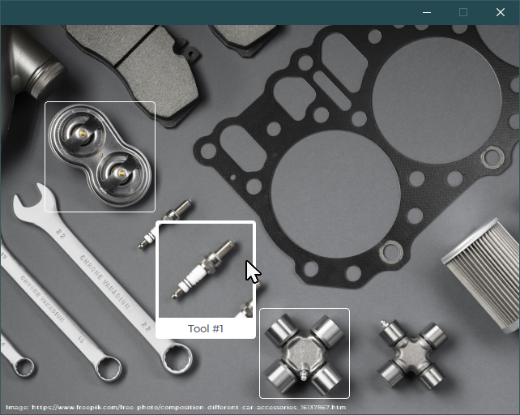

# 🎨Qt-templates
 
### ✨Highlight

---

### Styles

### ProgressBar

### StatusButtons 

#### ComboBox

#### PushButton

### SearchBar

### SideBar

### Hovering

### RotatedWidget + Hovering
Using PyQt5's QGraphicsProxyWidget, this feature allows for the creation of rotated QtWidgets within a QGraphicsScene. The functionality includes customizing widget styles and implementing hover events for interactive user experiences.

> 🚀Introducing support for [**YOLO-OBB**](https://docs.ultralytics.com/tasks/obb/) (_Oriented Bounding Boxes Object Detection_) output format! Check out the 👉[**code**](https://github.com/defmylife/Qt-Inspired/blob/main/RotatedWidget/RotatedWidgetWithYolo.py) snippet provided for implementation details.
> 
> 